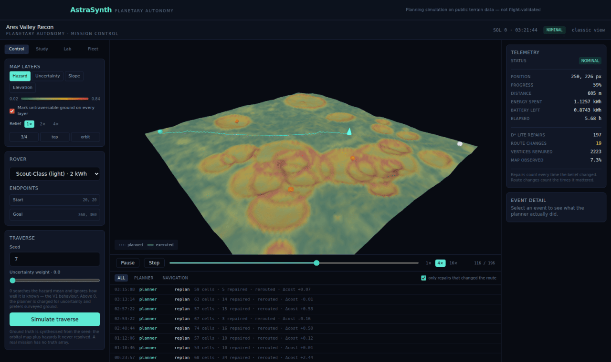
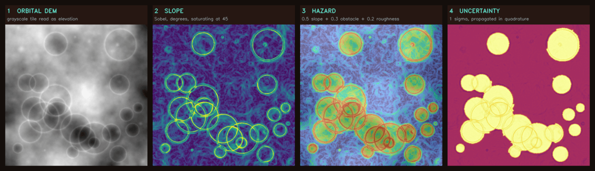
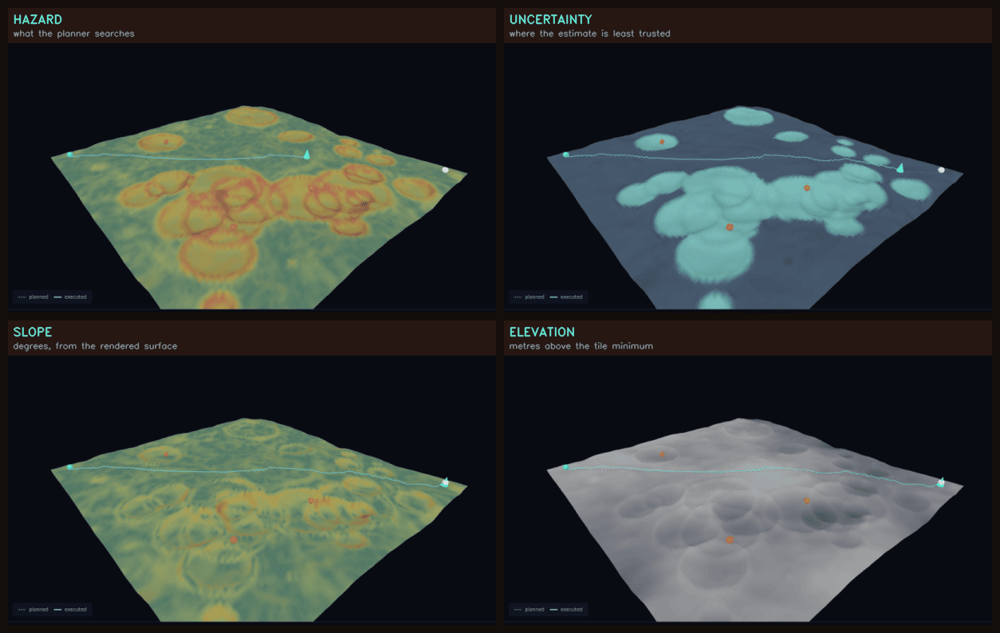

# AstraSynth

Planetary mission autonomy: terrain perception under uncertainty, four route planners over one cost model, multi-rover deconfliction, and mission-level simulation of what a rover actually knows.

[](https://github.com/IshaanS0112/AstraSynth/actions/workflows/ci.yml)
[](backend/tests)
[](backend/requirements.txt)
[](backend/pyproject.toml)
[](LICENSE)

`FastAPI` · `OpenCV` · `PostgreSQL` · `React + TypeScript` · `three.js` · `Docker`



<p align="center"><sub>Mission control, mid-traverse. The rover is 59% along a route it is repairing as it drives — 197 D* Lite repairs so far, 19 of which actually changed where it is going. More in <a href="docs/gallery.md">the gallery</a>.</sub></p>

---

## Background

Deciding where a rover can drive isn't one decision — it's a chain of concrete
computations. How steep is the ground. How well do we actually know that. What
can't be crossed at all. What's the cheapest route through what's left, and
cheapest by which measure. Can the battery pay for it. What happens when the
rover gets there and the ground isn't what the orbital map said.

AstraSynth implements that chain. The domain is planetary, but the shape —
sensor imagery → structured risk metrics under uncertainty → constrained
optimisation → execution against a world you can only partly see — is the same
one behind drone survey planning and warehouse robot routing.

Two design constraints hold throughout.

**Every number is traceable to the code that produced it.** Hazard scores, route
costs and feasibility verdicts are computed deterministically and stored with the
parameters that produced them; the language model is confined to the final step,
where it turns stored numbers into prose and is prevented from introducing any of
its own.

**The rover is never given the truth.** Reality, belief and observation are
separate objects, and a planner only ever searches belief. That distinction is
what makes replan counts, energy figures and mission success rates mean anything
— a rover that plans around a boulder it has no way of having seen produces
results that are optimistic by an unmeasurable amount.

---

## What it does

1. **Terrain analysis** — reads a grayscale DEM tile, computes per-pixel slope in degrees (Sobel), detects discrete obstacle regions (Canny → contours), measures surface roughness (local intensity variance), and classifies the terrain with an explainable rule set.
2. **Hazard mapping with propagated uncertainty** — combines slope, obstacle proximity and roughness into a bounded `[0, 1]` score, *and* carries a standard deviation derived from real error sources (DEM quantisation, Canny edge localisation, window sampling) combined in quadrature. See [`docs/uncertainty.md`](docs/uncertainty.md).
3. **Four route planners over one shared cost model** — A\* (optimal baseline), Theta\* (any-angle), D\* Lite (incremental repair), CBS (multi-rover). The cost model lives in one place so the planners are genuinely comparable. See [`docs/planners.md`](docs/planners.md).
4. **Multi-objective routing** — a weight sweep and a Pareto front instead of one route that is optimal for one weighting somebody chose.
5. **Belief, sensors and execution** — the rover drives with a range-limited, noisy, occlusion-aware sensor; observations update a Gaussian belief; D\* Lite repairs the route when the belief changes. Energy is charged against the *true* terrain, not the believed one.
6. **Mission layer** — science target selection under energy and instrument budgets, communication coverage by geometric line of sight plus orbiter windows, and an activity timeline. See [`docs/mission_model.md`](docs/mission_model.md).
7. **Monte Carlo robustness** — the same mission a thousand times with the noise resampled, reported as a success probability and percentiles, reproducible from one integer seed.
8. **Risk assessment and mission report** — length-normalised hazard exposure plus a battery feasibility check; every figure is frozen into a structured JSON context *first*, and the LLM narrates that context under a JSON-only contract with citations validated against it.

---

## The line between computed and narrated

This is the design decision the rest of the project hangs off.

| Stage | Who computes it |
|---|---|
| Slope, obstacles, roughness | OpenCV — `terrain_analyzer.py` |
| Hazard score per pixel | Weighted formula — `hazard_mapper.py` |
| Optimal route, distance, energy | A* — `planning/astar.py` |
| Route repair after a discovery | D* Lite — `planning/dstar_lite.py` |
| Fleet deconfliction | CBS — `planning/cbs.py` |
| Belief update from an observation | Bayes — `simulation/belief.py` |
| Mission success probability | Monte Carlo — `simulation/monte_carlo.py` |
| Risk tier, feasibility verdict | Arithmetic — `risk_engine.py` |
| Readable narrative | LLM — `report_generator.py` |

Every number in a generated report exists in `structured_context` before any model is called. That context is stored in the database, returned by `GET /missions/{id}/risk-report`, and rendered in the UI behind a "structured context (pre-LLM)" toggle. If the model call fails, times out, or returns malformed JSON, a template produces the same report from the same numbers — only the prose is missing. **With no `ANTHROPIC_API_KEY` configured at all, the system still produces complete mission reports.**

---

## Measured results

Every number below was produced by the scripts in `scripts/` on the machine that
wrote this file. None is quoted from elsewhere.

### A* against Dijkstra — `scripts/benchmark_planner.py`

Same grid, same cost function, heuristic on and off:

| Planning grid | A* nodes expanded | Dijkstra nodes | Reduction | Costs agree |
|---|---|---|---|---|
| 64 × 64 | 3,273 | 3,995 | 18.1% | ✅ |
| 128 × 128 | 13,331 | 16,369 | 18.6% | ✅ |
| 192 × 192 | 24,431 | 36,850 | 33.7% | ✅ |
| 256 × 256 | 41,280 | 65,523 | 37.0% | ✅ |

Run inside a Linux container; absolute timings depend on hardware, the expansion ratio doesn't. "Costs agree" matters more than the speedup: if A* ever returned a *cheaper* cost than Dijkstra, the heuristic would be inadmissible and the path wouldn't be optimal. `pytest` asserts this.

### Speed — the graph is compiled, not re-derived

Profiling put a third of A*'s runtime inside per-edge numpy scalar reads that
were neither search nor terrain analysis. The cost model is now compiled once
into flat lists (`planning/compiled.py`) and the planners search that:

| | Before | After |
|---|---|---|
| A* 192 × 192, warm grid | 298 ms | **62 ms** |
| CBS, 3 heterogeneous rovers | 13.1 s | **5.5 s** |
| Monte Carlo (1 core → 4 cores) | 2.9 trials/s | **23.6 trials/s** |
| Whole test suite | 141 s | **76 s** |

Every node count, cost and route is **unchanged** — that is what makes the
numbers meaningful, and `test_compiled_graph.py` asserts the compiled view
against the cost model edge-by-edge rather than trusting it.

### D* Lite against replanning from scratch — `scripts/benchmark_v3.py`

A full traverse with a sensor revealing a 3-cell radius. At every step where the
belief changed, D* Lite repairs *and* an A* is run from scratch on the same
updated map from the rover's current position, so the two are measured over
identical work:

| Grid | Steps | Repairs | D* Lite vertices | From-scratch A* nodes | Saving | Reroutes |
|---|---|---|---|---|---|---|
| 48 × 48 | 57 | 15 | 232 | 8,209 | 97.2% | 3 |
| 64 × 64 | 68 | 17 | 138 | 16,845 | 99.2% | 2 |
| 96 × 96 | 111 | 19 | 171 | 23,856 | 99.3% | 2 |

This is the case D* Lite is *for* — small local surprises found while driving.
On a single large map change it has no advantage and can be worse. `pytest`
asserts the thing that makes the saving worth having: after any sequence of moves
and reveals, D* Lite's route and cost are **identical** to a fresh A* on the
current map.

### Theta* against A* — route shape

Open ground broken by discrete rocks. Cost is *not* compared: A* sums grid steps
and Theta* integrates a sampled line integral, so they are not two measurements
of one quantity. Length and heading changes are.

| Grid | A* length | Theta* length | Shorter | A* turns | Theta* turns | A* ms | Theta* ms |
|---|---|---|---|---|---|---|---|
| 48 × 48 | 131.0 m | 124.8 m | 4.7% | 17 | 7 | 10 | 147 |
| 64 × 64 | 176.2 m | 168.7 m | 4.3% | 17 | 6 | 12 | 240 |
| 96 × 96 | 269.1 m | 259.5 m | 3.6% | 28 | 18 | 32 | 566 |

Fewer than half the turns, and 10–18× slower. Theta* is not optimal and A*
remains the default.

### There is no single best route — Pareto front

Nine weightings of the same cost model over a 50 × 50 field, each route then
measured on the *unweighted* model so they stay comparable:

| Weighting | Distance | Energy | Mean hazard | Max hazard |
|---|---|---|---|---|
| `w_h=0, w_e=0` | 132.9 m | 0.4138 kWh | 0.273 | 0.536 |
| `w_h=1, w_e=1` (V1 default) | 137.6 m | 0.4274 kWh | 0.173 | 0.461 |
| `w_h=2, w_e=1` | 140.0 m | 0.4354 kWh | 0.160 | 0.385 |
| `w_h=8, w_e=1` | 147.0 m | 0.4596 kWh | 0.135 | 0.380 |

10.6% further for 51% less mean hazard exposure. Which one to fly is a mission
decision, not a solver decision. The sweep recovers the convex hull of the true
front, not all of it — see [`docs/planners.md`](docs/planners.md).

### Mission success is a distribution, not a number

30 trials, seed 42, terrain and sensor noise and energy draw resampled per trial:

```
Mission success probability: 83.3%
Failures by mode: {'LOW_BATTERY': 5}
Energy over successful trials: P10 0.4275 / P50 0.4983 / P90 0.5777 kWh
```

P90 is the number a battery is sized against. Same seed, same numbers — and
trial *k* is independent of the trial count, so a study can be extended without
invalidating what came before.

### The analysis chain, and the same ground four ways





More, with what each one shows, in [the gallery](docs/gallery.md).

### Hazard uncertainty is derived, not assigned

| Terrain | Mean hazard | Mean σ | p95 σ |
|---|---|---|---|
| `sandy_plain` | 0.0614 | 0.0798 | 0.1008 |
| `crater_field` | 0.2532 | 0.1036 | 0.1683 |

Each component's σ comes from a named error source — DEM quantisation, Canny
edge localisation, window sampling — combined in quadrature. Smooth ground reads
as more certain than cratered ground, which is the direction the physics
requires. See [`docs/uncertainty.md`](docs/uncertainty.md).

Rule-based terrain classification on the three generated presets:

| Terrain | Mean slope | Obstacles | Obstacle area | Classified as |
|---|---|---|---|---|
| `sandy_plain` | 2.4° | 13 | 4.7% | `sandy_plain` ✅ |
| `rocky_highland` | 7.3° | 50 | 8.6% | `rocky_highland` ✅ |
| `crater_field` | 9.0° | 9 | 30.7% | `crater_field` ✅ |

This is self-consistency against terrain I generated to be those types — **not** validation against labelled Mars terrain, which this repo does not have and does not claim.

---

## Scope

**This is a mission-planning simulation built on public terrain imagery. It does not control real rover hardware, does not ingest live telemetry, and has not been validated against actual mission data.** Rover configurations are illustrative parameter sets of the right order of magnitude, not manufacturer specifications.

`docs/architecture.md` has a full "What's real vs simulated" breakdown and the list of bugs found while building it.

---

## Quick start

> [`docs/SETUP.md`](docs/SETUP.md) has the full walkthrough with a verification
> check after each step, development-without-Docker instructions, and
> troubleshooting.

```bash
git clone https://github.com/IshaanS0112/AstraSynth.git && cd AstraSynth

# Generate sample terrain (no download required, runs offline)
pip install opencv-python-headless numpy
python scripts/generate_terrain.py

# Bring up Postgres + API + dashboard
export ANTHROPIC_API_KEY=sk-...      # optional; without it, reports use the fallback
docker compose up --build
```

- Dashboard → http://localhost:5173
- API docs → http://localhost:8000/docs

Then: **New mission** → upload a tile from `data/sample_terrain/` → **Analyse terrain** → click a start and goal on the map → **Plan path** → **Assess risk** → **Generate report**.

### Without Docker

Needs Python 3.10+.

```bash
# Backend
cd backend
python -m venv .venv && source .venv/bin/activate
pip install -r requirements-dev.txt
cp .env.example .env                 # point DATABASE_URL at your Postgres
uvicorn app.main:app --reload

# Frontend
cd frontend && npm install && npm run dev
```

### Run it with no database at all

```bash
# V1 pipeline: CV -> hazard -> A* -> risk -> report
python scripts/run_pipeline_demo.py data/sample_terrain/synthetic_crater_field_512.png \
    --rover survey --compare-dijkstra --json

# V3 mission: terrain -> uncertainty -> science tour -> comms -> traverse with
# D* Lite repairing as the rover discovers ground -> Pareto -> fleet -> Monte Carlo
python scripts/run_mission_demo.py

# Every benchmark table in the docs
python scripts/benchmark_planner.py
python scripts/benchmark_v3.py
```

The fastest way to see that the numbers come out of the algorithms rather than
the API layer.

---

## Terrain data

The repo ships a **generator**, not a dataset. `scripts/generate_terrain.py` produces fractal heightfields (diamond-square) with stamped craters and rock fields — statistically similar to real terrain, reproducible from a seed, and small enough to live in git.

For real data, `scripts/prepare_usgs_terrain.py` crops a tile out of the USGS global Mars DEM:

> **Mars MGS MOLA — MEX HRSC Blended DEM Global 200m v2**, USGS Astrogeology Science Center, 2018.
> [Catalogue entry](https://astrogeology.usgs.gov/search/map/mars_mgs_mola_mex_hrsc_blended_dem_global_200m)
>
> Fergason, R. L., Hare, T. M., & Laura, J. (2018). *HRSC and MOLA Blended Digital Elevation Model at 200m v2.* Astrogeology PDS Annex, U.S. Geological Survey.

The global product is ~11 GB, so the script reads a window out of a file you've downloaded rather than pulling it automatically. It writes a sidecar JSON with the tile's true elevation range so `ELEVATION_RANGE_M` is set from the data instead of guessed — get that wrong and every slope angle downstream is off by a constant factor.

---

## Tests

```bash
cd backend && python -m pytest -v
```

**252 tests.** 218 need no network and no database; the remaining 34 drive the
full HTTP surface against PostgreSQL and skip automatically if none is reachable.
CI runs all 252 against a service container and fails the build if the
database-backed ones are silently skipped.

Coverage by claim:

- **A\* correctness** — optimal diagonal on flat terrain against a hand-computed distance; identical cost to Dijkstra on random terrain (the empirical admissibility check); detour around an impassable cliff; `PathNotFoundError` when the goal is genuinely walled off; no step ever exceeds the rover's slope limit.
- **Energy model** — flat-ground energy equals rate × distance exactly; climbing the same distance costs strictly more than the flat case; cumulative energy is monotonic and matches the total.
- **Slope estimation** — a ramp rising 1 m per 1 m of ground reads as 45.0°, which is what catches a wrong Sobel normalisation constant.
- **Risk and feasibility** — every threshold boundary including the exact-equality cases; all three risk tiers are reachable from real inputs; the score stays in `[0, 1]` even when a plan is infeasible.
- **Report generation** — hallucinated segment IDs are dropped; malformed JSON and model exceptions degrade to the fallback instead of propagating.

- **API contract** — create → analyse → plan → assess → report in order; out-of-order calls return 409; an unreachable goal returns 422, not 500; server filesystem paths never appear in a response.
- **Shared cost model** — every edge satisfies `cost ≥ distance_m` over a whole random grid (the precondition every heuristic here rests on); negative objective weights are refused; a diagonal cannot clip the corner of a lethal cell; payload scales energy but never search cost.
- **D\* Lite** — repaired route and cost identical to a fresh A* after randomised reveals, and again after the rover has moved (which is what exercises the `k_m` bookkeeping); re-observing known ground triggers *no* repair; repair expansions an order of magnitude below from-scratch search.
- **Theta\*** — the exact straight line on open ground; strictly fewer turns than A*; every returned segment independently re-checked as drivable, including a ravine whose endpoints are level.
- **CBS** — solutions verified conflict-free by an independent checker, never by the solver's own report; a head-on swap resolved; a heterogeneous pair where the ridge is crossable by one rover and not the other; an unpassable corridor reported as `CONFLICT_UNRESOLVED` rather than a colliding answer; the wall-clock budget enforced.
- **Belief and sensors** — repeated observations converge on the truth and tighten σ; a precise sensor moves the mean further than a vague one; a settled belief reports no change; a ridge hides the ground behind it.
- **Execution** — the planner is never handed the truth (asserted directly: the template grid is unmutated and unobserved cells still hold the prior); energy is charged against the true terrain; an exhausted battery is `LOW_BATTERY` with diagnostics, not a silent over-budget success.
- **Monte Carlo** — identical results for identical seeds; trial *k* independent of the trial count; percentiles ordered and taken over successful trials only.
- **Uncertainty** — the quadrature formula checked against a recomputation from components; halving the DEM range halves the slope σ; every component respects the Bernoulli bound.

The API tests need PostgreSQL because the schema uses `JSONB` and native `UUID`, which SQLite cannot emulate. Rewriting the models to generic JSON purely so the tests could run in-memory would mean testing a schema the application never uses.

---

## API

| Method | Endpoint | |
|---|---|---|
| `POST` | `/missions` | Create mission (multipart terrain upload) |
| `GET` | `/missions` · `/missions/{id}` | List / fetch |
| `POST` | `/missions/{id}/analyze-terrain` | Run the CV pipeline |
| `GET` | `/missions/{id}/terrain-analysis` | Slope map, heatmap, contours, classification |
| `POST` | `/missions/{id}/plan-path` | A* plan for a start, goal, and rover |
| `GET` | `/missions/{id}/path` · `/paths` | Latest / all plans |
| `POST` | `/missions/{id}/assess-risk` | Deterministic risk + feasibility (no model call) |
| `GET` | `/missions/{id}/risk-report` | Risk verdict + structured context |
| `POST` | `/missions/{id}/generate-report` | Narrate the stored context |
| `GET` | `/missions/{id}/ai-report` | Generated narrative |
| `GET` `POST` | `/rover-configs` | List / create rover configurations |

### Mission autonomy

| Method | Endpoint | |
|---|---|---|
| `GET` | `/missions/{id}/terrain-grid` | Elevation, hazard, uncertainty, slope and lethal layers for the 3-D view |
| `GET` `POST` `DELETE` | `/missions/{id}/science-targets` | Objectives, in image-pixel coordinates |
| `POST` | `/missions/{id}/simulate-traverse` | Drive it without knowing the terrain; D\* Lite repairs as the rover discovers |
| `GET` | `/missions/{id}/traverses` · `/traverses/{run}` | Run summaries / a full run |
| `GET` | `/missions/{id}/traverses/{run}/events` | Mission event log, filterable by category and kind |
| `POST` | `/missions/{id}/route-study` | Sweep the objective weights; return the Pareto front |
| `POST` | `/missions/{id}/monte-carlo` | Seeded robustness study |
| `POST` | `/missions/{id}/fleet-plan` | CBS deconfliction over a heterogeneous fleet |
| `POST` | `/missions/{id}/science-tour` | Target selection under energy, time and instrument budgets |
| `GET` | `/missions/{id}/experiments` · `/experiments/{id}` | Every study, with its seed and code revision |

A failed *mission* is a `200` with `status: FAILED` and a diagnosed
`failure_mode` — "these rovers cannot be deconflicted inside this budget" is a
finding worth storing, not a broken request. A failed *request* is still a 4xx.

Studies run synchronously, so their size is bounded in the schema rather than
left to time out. See [`docs/v3_roadmap.md`](docs/v3_roadmap.md).

---

## Structure

```
backend/app/services/
  terrain_analyzer.py      Sobel slope · adaptive Canny · contours · roughness · classification
  hazard_mapper.py         Weighted hazard · propagated uncertainty · heatmap · downsample
  path_planner.py          V1-compatible A* entry point over the shared model
  risk_engine.py           Risk tiering · battery feasibility
  report_generator.py      Structured context → constrained LLM → validated → fallback
  mission_pipeline.py      Stage orchestration and persistence
  planning/
    grid.py                THE cost model · constraint layers · supercover · line of sight
    astar.py               A* and Dijkstra
    theta_star.py          Any-angle, explicitly not optimal
    dstar_lite.py          Incremental repair against a changing belief
    cbs.py                 Conflict-based search · CAT · disjoint splitting
    pareto.py              Weight sweep · non-dominated filter
    outcome.py             Failure modes with diagnostics
    trace.py               Cells → reportable path
  simulation/
    belief.py              Gaussian belief · Bayesian update · uncertainty-averse surface
    sensors.py             Range · noise · occlusion
    execution.py           Traverse under partial observability · event log
    monte_carlo.py         Seeded stochastic mission study
  mission/
    comms.py               Ground relay line of sight · orbiter windows · blackouts
    science.py             Orienteering-style target selection under budget
    scheduling.py          Activity timeline
backend/tests/             210 tests
frontend/src/
  three/TerrainScene.ts    The 3-D renderer: plain class, no React, four setters
  mission-control/         3-D wrapper · console panels · Pareto and robustness charts
  pages/MissionControl.tsx Mission control: terrain dominant, panels drill down
  pages/                   Dashboard · MissionDetail · NewMission (the classic flow)
scripts/
  generate_terrain.py      Synthetic fractal terrain with craters and rock fields
  prepare_usgs_terrain.py  Crop real USGS Mars DEM tiles
  run_pipeline_demo.py     V1 pipeline, no database
  run_mission_demo.py      Full V3 mission, end to end
  benchmark_planner.py     A* vs Dijkstra
  benchmark_v3.py          Theta* · D* Lite · CBS · Pareto · Monte Carlo · comms
  check_mission_control.mjs Drives the 3-D view in a real browser (not in CI)
docs/
  architecture.md          Design decisions · real vs simulated · bugs found
  planners.md              Four planners, their guarantees, and their limits
  uncertainty.md           Reality vs belief vs observation · propagation · Monte Carlo
  mission_model.md         Science · communications · scheduling · failure modes
  frontend.md              Why the renderer is not a React component; layers; playback
  gallery.md               Screenshots from a real run, with what each one shows
  v3_roadmap.md            What was audited, what was built, what is not built yet
```

---

## Continuous integration

Every push runs five jobs: the backend suite on Python 3.10 and 3.13 against a
PostgreSQL service container, `ruff` lint and format checks, frontend typecheck
and production build, both Docker images, and an end-to-end smoke test that
regenerates terrain, re-runs the A*/Dijkstra comparison and drives the full V3
mission demo. The last one exists so that a change to the CV pipeline, the cost
model or a planner that silently moves a documented number fails the build
rather than the README.

---

## Roadmap

- [x] OpenCV terrain analysis with adaptive thresholding
- [x] Weighted hazard scoring with stored calculation basis
- [x] A* with energy-aware cost + lethal-hazard layer
- [x] Battery feasibility engine
- [x] Structured-context report generation with validated citations and fallback
- [x] React dashboard with interactive start/goal selection
- [x] Docker Compose stack, 210 tests, CI across Python 3.10 and 3.13
- [x] One shared cost model, so the planners are genuinely comparable
- [x] Propagated hazard uncertainty from named error sources
- [x] Belief / observation / reality separation with a range-limited noisy sensor
- [x] Theta\* any-angle planning
- [x] Dynamic re-planning against simulated obstacle discovery mid-traverse (D\* Lite)
- [x] Multi-rover coordination over heterogeneous rovers (CBS)
- [x] Multi-objective routing and a Pareto front
- [x] Communication-aware route evaluation and mission scheduling
- [x] Monte Carlo mission robustness, reproducible from one seed
- [x] HTTP API over the V3 engines, with persistence and experiment provenance
- [x] Mission-control frontend: 3D terrain, layer toggles, traverse replay, event log
- [x] Scenario building (click the terrain to place targets) and a robustness lab
- [ ] Background job queue, so a study can outlive a request
- [ ] Communications coverage as a map layer
- [ ] Active exploration — moving somewhere purely to reduce uncertainty
- [ ] CNN terrain classifier compared head-to-head against the rule-based one

---

## Licence

MIT — see [LICENSE](LICENSE).

Terrain data from USGS Astrogeology is public domain; the citation above is
required by the dataset's access constraints.
