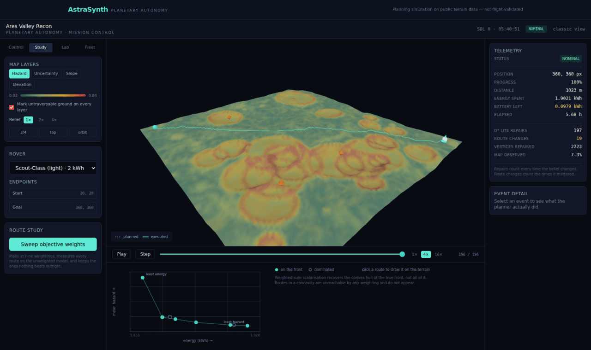
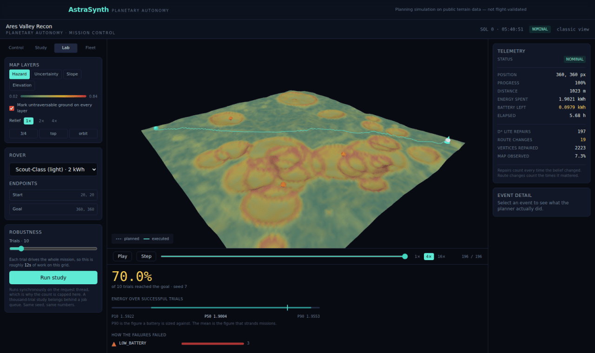

# Gallery

Screenshots from a real run against generated terrain, captured by
`scripts/check_mission_control.mjs`. Nothing here is a mock-up.

---

## Mission control


The terrain is the application. It is coloured by the hazard layer here — the
weighted blend of slope, obstacle proximity and roughness that the planner
actually searches — with crater rims reading amber and red. The teal line is the
route the rover has *driven*; the dashed line under it is the route it originally
planned from the orbital map.

The right rail separates two numbers that are easy to conflate. **D\* Lite repairs**
counts every time the belief map changed enough to re-run the incremental
search — with a noisy sensor that is most steps. **Route changes** counts the times
that repair produced a different next move. 197 against 19: the rover was
constantly re-checking and rarely surprised, which is what you want and is
invisible if you only report one of them.

The event log is filtered to repairs that changed the route by default, and each
row carries what the repair cost: cells that disagreed, vertices repaired, and the
change in cost-to-goal.

---

## Route study — the trade-off surface



The same start and goal, planned at nine weightings of the cost model, each route
then measured on the *unweighted* model so they stay comparable. What survives is
the set where buying an improvement in one objective means paying for it in
another — 1.833 kWh at higher hazard exposure through to 1.928 kWh at the lowest.

Filled marks are on the front; hollow ones are dominated. Only the two corners are
labelled. Clicking a route draws it on the terrain.

The caption under the plot is part of the chart: weighted-sum scalarisation
recovers the convex hull of the true front and nothing in a concavity, so this is
a subset of the real trade-off set and says so.

---

## Robustness — a distribution, not a number



The same mission ten times, with the terrain, the sensor noise and the per-metre
energy draw resampled from one seed. Seven of ten reached the goal; the other
three ran the battery down.

The headline is the success rate because that is the question. Below it, the
energy figures are percentiles rather than a mean — P90 is what a battery gets
sized against — and the failures are broken down by mode, because "it failed" and
"it failed for lack of power" call for different responses.

Same seed, same numbers. Trial *k* does not depend on how many trials were run, so
a study can be extended without invalidating what came before.

---

## Reproducing these

```bash
docker compose up -d db
(cd backend && uvicorn app.main:app --port 8000)
(cd frontend && npm run dev)

# a mission with terrain analysed
curl -s -X POST localhost:8000/missions -F name="Ares Valley Recon" \
  -F terrain_image=@data/sample_terrain/synthetic_crater_field_512.png
curl -s -X POST localhost:8000/missions/<id>/analyze-terrain > /dev/null

npm --prefix frontend install --no-save playwright
npm --prefix frontend exec playwright install chromium
node scripts/check_mission_control.mjs <id>
```

For the numbers behind the interface rather than the interface itself:

```bash
python scripts/run_mission_demo.py     # the full pipeline, end to end
python scripts/benchmark_v3.py         # every benchmark table in the docs
```
