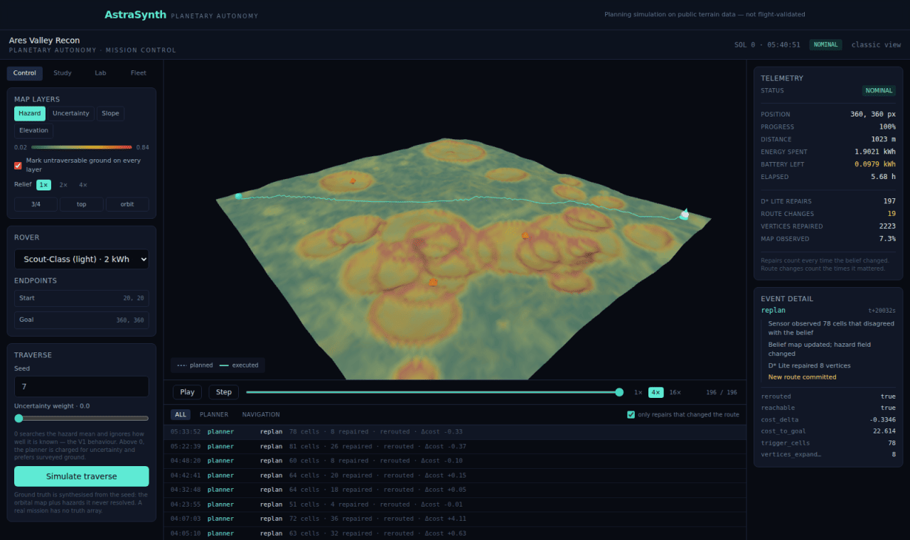
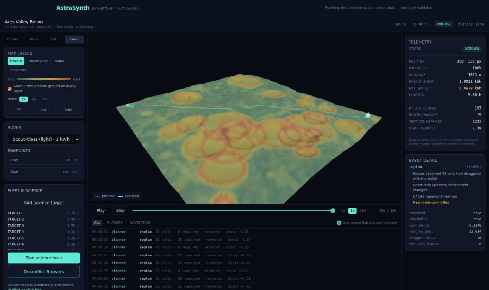
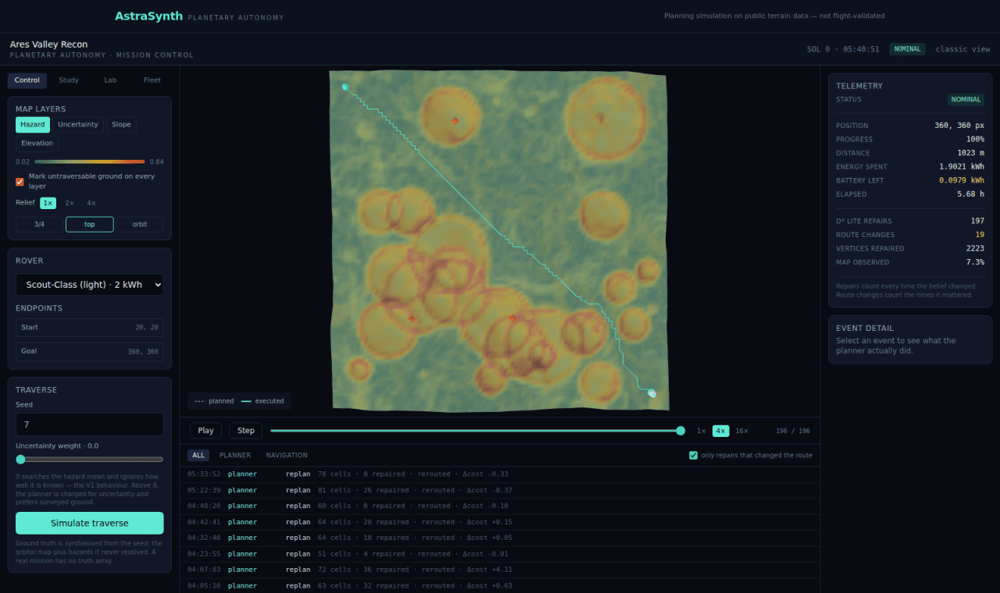

# Gallery

Screenshots from a real run against generated terrain, captured by
`scripts/check_mission_control.mjs`. Nothing here is a mock-up.

---

## Mission control


The terrain is the application. It is coloured by the hazard layer here — the
weighted blend of slope, obstacle proximity and roughness that the planner
actually searches — with crater rims reading amber and red. The teal line is the
route the rover has *driven*; the dashed line under it is the route it originally
planned from the orbital map.

The right rail separates two numbers that are easy to conflate. **D\* Lite repairs**
counts every time the belief map changed enough to re-run the incremental
search — with a noisy sensor that is most steps. **Route changes** counts the times
that repair produced a different next move. 197 against 19: the rover was
constantly re-checking and rarely surprised, which is what you want and is
invisible if you only report one of them.

The event log is filtered to repairs that changed the route by default, and each
row carries what the repair cost: cells that disagreed, vertices repaired, and the
change in cost-to-goal.

---

## The analysis chain


Four stages over one tile, all four written to `storage/<mission>/` by
`POST /analyze-terrain`. Slope is Sobel over the elevation model; hazard is the
weighted blend; uncertainty is 1σ propagated in quadrature from DEM
quantisation, Canny edge localisation and window sampling.

The uncertainty panel is worth a second look, because it is nearly bimodal —
bright at and inside crater rims, dark on the plains. That is not a rendering
artefact: the obstacle-proximity term's σ goes as `1/(1+d)²` and dominates the
quadrature sum near an obstacle while collapsing to almost nothing away from
one. The field really is concentrated. The colour scale saturates at the 99th
percentile of the field rather than a fixed constant, and the value used is
recorded in `analysis_metadata.uncertainty_map_scale` — a colour map whose scale
is not written down is not a measurement.

---

## The same ground, four ways


Same terrain, same camera, same route. Switching layers rewrites a colour
attribute; it does not rebuild the mesh.

Untraversable ground is marked on **every** layer, not only the hazard one — an
operator reading the slope map still needs to see where the rover cannot go, and
making them infer it from another tab is how a route gets approved across a
crater rim.

Relief is drawn to true scale: one metre of rise is the same length as one metre
across. Exaggeration is a labelled 1×/2×/4× control rather than a default,
because a slope layer is only trustworthy at true scale and 40 m of relief across
a 1 km tile is nearly invisible at it.

---

## A repair, unpacked



Clicking a repair in the event log reconstructs what happened, in order: the
sensor observed 78 cells that disagreed with the belief, the belief map was
updated, D* Lite repaired 8 vertices, and a new route was committed. Underneath,
the raw record — `rerouted`, `cost_delta`, `cost_to_goal`, `trigger_cells`,
`vertices_expanded`.

Eight vertices. A fresh A* from that position on that map expands thousands. That
ratio is the entire argument for incremental replanning, and it is visible here
per repair rather than asserted in a README.

---

## Fleet deconfliction



Three rovers, three different graphs over the same terrain — each carries its own
slope limit, so a ridge the Heavy Lab crosses is a wall to the Scout. CBS
branches in the space of constraints rather than the joint state space.

The panel reports the constraint-tree node count and, separately, that the
solution was **verified conflict-free** — by an independent check over the
returned routes, not by the solver's own report. Coordination runs on a coarser
grid than navigation, deliberately: the low-level state space is cells × ticks,
and the question being answered is who crosses the middle first, not which rock
to pass on the left.

---

## Route study — the trade-off surface


The same start and goal, planned at nine weightings of the cost model, each route
then measured on the *unweighted* model so they stay comparable. What survives is
the set where buying an improvement in one objective means paying for it in
another — 1.833 kWh at higher hazard exposure through to 1.928 kWh at the lowest.

Filled marks are on the front; hollow ones are dominated. Only the two corners are
labelled. Clicking a route draws it on the terrain.

The caption under the plot is part of the chart: weighted-sum scalarisation
recovers the convex hull of the true front and nothing in a concavity, so this is
a subset of the real trade-off set and says so.

---

## Robustness — a distribution, not a number


The same mission ten times, with the terrain, the sensor noise and the per-metre
energy draw resampled from one seed. Seven of ten reached the goal; the other
three ran the battery down.

The headline is the success rate because that is the question. Below it, the
energy figures are percentiles rather than a mean — P90 is what a battery gets
sized against — and the failures are broken down by mode, because "it failed" and
"it failed for lack of power" call for different responses.

Same seed, same numbers. Trial *k* does not depend on how many trials were run, so
a study can be extended without invalidating what came before.

---

## Top-down



The camera presets — three-quarter, top, orbit — exist because the three-quarter
view that reads best for landform reads worst for *route geometry*. Top-down is
where you check whether a detour actually went around the thing it was avoiding.

---

## Reproducing these

```bash
docker compose up -d db
(cd backend && uvicorn app.main:app --port 8000)
(cd frontend && npm run dev)

# a mission with terrain analysed
curl -s -X POST localhost:8000/missions -F name="Ares Valley Recon" \
  -F terrain_image=@data/sample_terrain/synthetic_crater_field_512.png
curl -s -X POST localhost:8000/missions/<id>/analyze-terrain > /dev/null

npm --prefix frontend install --no-save playwright
npm --prefix frontend exec playwright install chromium
node scripts/check_mission_control.mjs <id>
```

For the numbers behind the interface rather than the interface itself:

```bash
python scripts/run_mission_demo.py     # the full pipeline, end to end
python scripts/benchmark_v3.py         # every benchmark table in the docs
```
